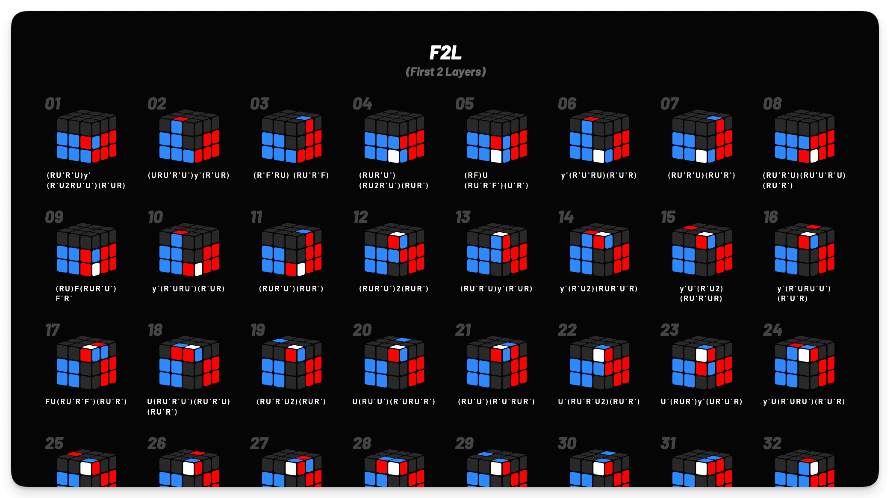
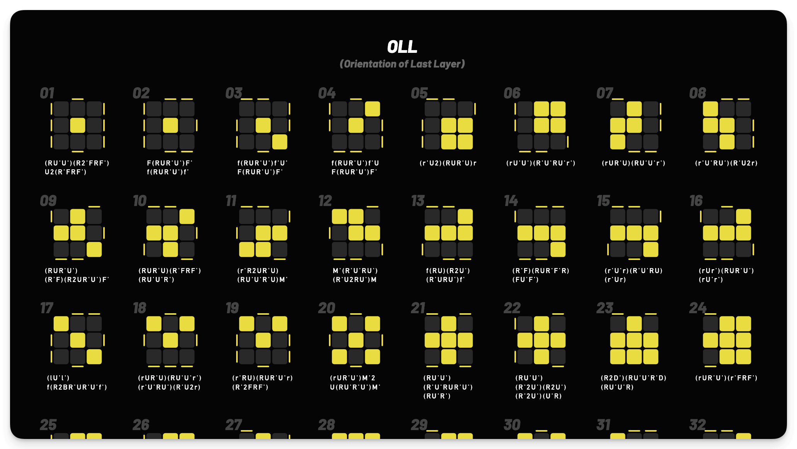

# CFOP

https://cfop.bener.cc

> CFOP(Cross F2L OLL PLL) is a widely used speedcubing method.

A open-source website for learning CFOP Rubik’s Cube algorithms.

## Screenshot

## Attribution

Thanks to the cubing community for sharing algorithm collections and resources.

## License

This project is licensed under the MIT License.

©2025-present, [Bener](https://github.com/Heroor)
